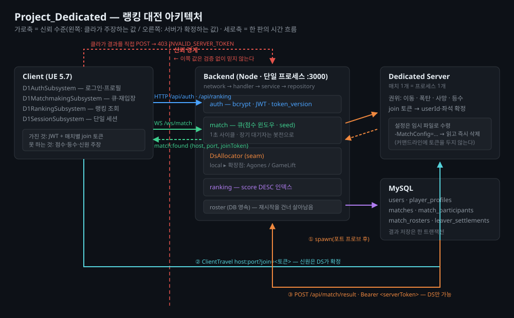

# Project_Dedicated

Top-Down 4인 **봄버맨** PvP — 언리얼 **Dedicated Server** + 자체 백엔드(인증/매칭/랭킹) 기반 랭킹 대전.

매칭이 성사되면 백엔드가 **매치당 DS 프로세스를 하나씩 띄우고**, 4명을 그 서버로 보낸다.
경기 결과는 **DS만** 보고할 수 있으며(매치별 서버 토큰), 클라이언트의 점수 직접 전송은 거부된다.

---

## Stack

| 영역 | 사용 기술 |
|---|---|
| Client / Dedicated Server | Unreal Engine 5.7 (소스 빌드), C++ 모듈 `D1` |
| Backend | Node.js 20+ · TypeScript · Express 5 · `ws` · pino |
| DB | MySQL 8 (`mysql2`) |
| Auth | bcrypt + JWT (단일 세션 강제) |
| 통신 | HTTP(`FHttpModule`) + WebSocket(`IWebSocketsModule`) — 같은 host:port |

---

## Architecture



- **인증/랭킹** — 클라 ↔ 백엔드 HTTP
- **매칭** — 클라 ↔ 백엔드 WebSocket(`/ws/match`). 점수 윈도우가 대기 시간에 비례해 넓어지는 seed 기반 큐
- **DS 할당** — 매칭 성사 시 백엔드가 빈 포트를 잡아 `D1Server.exe` spawn → DS가 준비되면 콜백 → 4명에게 주소 푸시
- **결과 보고** — DS → 백엔드 HTTP(매치별 serverToken). ELO + 등수 배점으로 점수 갱신
- **신뢰 경계** — 클라는 자기 점수·등수를 주장할 수 없다. 신원은 매치별 1회용 join token으로 DS가 확정한다

---

## Repository Layout

```
Project_Dedicated/
├── D1/                  # 언리얼 프로젝트 (클라/DS 공용 C++ 소스)
│   ├── Source/D1/       # Core · Framework · Game · Network · Systems · UI
│   └── Packaged/        # 패키징 산출물 Client/ · Server/ (gitignored)
├── Backend/             # Node.js 백엔드
│   ├── src/             # auth · match(matchmaking·ds·roster·result) · ranking · common (4-레이어)
│   ├── migrations/      # 순차 SQL 마이그레이션
│   ├── scripts/         # 시나리오 테스트 하네스
│   └── tests/           # vitest 단위 테스트 (DB 불필요)
├── BackendMcp/          # 백엔드 상태 조회용 MCP 서버
├── assets/              # README용 다이어그램
└── README.md
```

---

## Getting Started

### 사전 준비

- **Unreal Engine 5.7 소스 빌드** — Dedicated Server 타깃을 만들려면 소스 엔진이 필요하다
- **Node.js 20+**, **MySQL 8**

### 1. Backend

```bash
cd Backend
npm ci
cp .env.example .env          # DB_PASS·JWT_SECRET·MATCH_DS_EXE 채우기
```

MySQL에 DB를 먼저 만든다:

```sql
CREATE DATABASE d1 DEFAULT CHARACTER SET utf8mb4 COLLATE utf8mb4_unicode_ci;
```

```bash
npm run migrate               # 스키마 적용 (migrations/ 순차, 재실행 안전)
npm run dev                   # tsx watch — http://127.0.0.1:3000
```

설정 변수·엔드포인트 전체 목록은 [`Backend/README.md`](./Backend/README.md) 참조.

### 2. 클라이언트 (에디터)

`D1/D1.uproject` 더블클릭, 또는

```bash
"<UE_ROOT>/Engine/Binaries/Win64/UnrealEditor.exe" "<repo>/D1/D1.uproject"
```

클라이언트는 기본으로 `http://127.0.0.1:3000`의 백엔드에 붙는다. 다른 주소는
`-BackendUrl=` 커맨드라인 인자, 또는 `D1/Config/DefaultGame.ini`의
`[/Script/D1.D1OnlineSettings] BaseUrl`로 바꾼다 (우선순위: 커맨드라인 > ini > 기본값).
ini에 적을 땐 **URL을 따옴표로 감싼다** — ini 파서가 `//` 뒤를 주석으로 잘라낸다.

C++만 컴파일 검증하려면 (에디터를 켜둔 채로도 `D1Server` 타깃은 빌드된다):

```bash
"<UE_ROOT>/Engine/Build/BatchFiles/Build.bat" D1Server Win64 Development \
  -project="<repo>/D1/D1.uproject" -waitmutex
```

### 3. Dedicated Server 패키징

```bash
"<UE_ROOT>/Engine/Build/BatchFiles/RunUAT.bat" BuildCookRun \
  -project="<repo>/D1/D1.uproject" \
  -noP4 -platform=Win64 -serverconfig=Development \
  -server -noclient -cook -build -stage -pak -archive \
  -archivedirectory="<repo>/D1/Packaged/Server"
```

산출물: `D1/Packaged/Server/WindowsServer/D1Server.exe` (약 2~3분).
이 경로를 `.env`의 `MATCH_DS_EXE`에 절대경로로 적고 `MATCH_DS_ENABLED=true`로 둔다.

> 게임플레이 C++을 고친 뒤에는 **DS를 다시 패키징해야** 실제 매치에 반영된다.

### 4. 로컬에서 한 판 돌려보기

1. 백엔드 실행 (`npm run dev`)
2. 에디터에서 PIE(Standalone) 실행 → 회원가입 → 로그인 → 매칭
3. 상대가 없으면 `MATCH_BOT_FILL_MS` 경과 후 **봇 3명과 즉시 매치**된다
4. 사람 여러 명을 흉내 내려면: `npm run match:bots 3` (테스트 계정이 큐에 들어간다)

---

## 테스트 하네스

`cd Backend` 후 실행. 순수 로직 단위 테스트는 `npm test`(vitest — DB 불필요).
아래 표는 DB·프로세스를 실제로 쓰는 시나리오 하네스.

| 명령 | 검증 대상 |
|---|---|
| `npm run match:sim` | 매칭 큐 알고리즘 — 윈도우 확장·선착순·봇전 수집 |
| `npm run match:elo` | ELO 계산 — 제로섬·업셋 보상·동률 처리 |
| `npm run match:result-sim` | 결과 저장 트랜잭션·멱등성·미보고 매치 abort 기록 |
| `npm run match:rejoin-sim` | 재입장 판정 — 끝난 매치·탈주자를 걸러내는가 |
| `npm run match:restart-survival-sim` | 백엔드 재시작 생존 — 죽었다 살아나도 결과를 받는가 |
| `npm run match:authority-demo` | 서버 권위 — 유효한 JWT로도 결과 POST가 403으로 거부되는가 |
| `npm run ranking:sim` | 랭킹 조회·페이지네이션·동점 타이브레이크 |
| `npm run auth:session-sim` | 단일 세션 강제(token_version) |
| `npm run match:bots [n]` | 테스트 계정 n명을 큐에 투입(수동 E2E용) |

---

## 서버 권위 모델

- 매치 결과·점수는 **DS만** 보고한다. 클라이언트가 `/api/match/result`를 직접 호출하면 `403 INVALID_SERVER_TOKEN`
- 서버 토큰과 플레이어별 join 토큰은 **커맨드라인이 아니라 임시 설정 파일**로 DS에 전달되고, DS는 읽는 즉시 파일을 지운다
- 플레이어의 userId·좌석은 클라가 주장하지 않는다 — DS가 join 토큰으로 백엔드 명단과 대조해 확정한다

---

## 알려진 한계 (로컬 데모 기준)

- **TLS 미적용** — JWT·서버 토큰이 평문으로 오간다. 원격 배포 시 리버스 프록시 종단 + `app.set('trust proxy')` 필요
- **단일 프로세스** — 큐·준비 게이트가 인메모리라 백엔드를 수평 확장할 수 없다. 다만 진행 중인 경기는 백엔드 수명과 분리돼 있어, 백엔드가 죽어도 경기는 끝나고 결과는 저장된다(`npm run match:restart-survival-sim`)
- **DS는 같은 머신에서만 spawn** — 원격 오케스트레이터(Agones 등) 대비로 `DsAllocator` 인터페이스 뒤에 격리해 두었다
